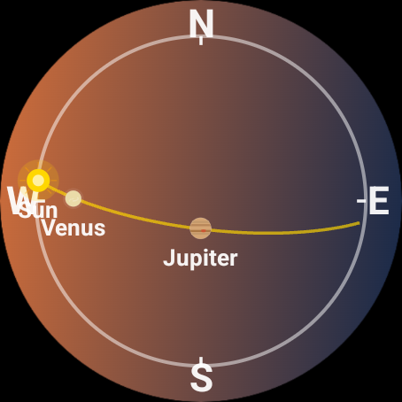
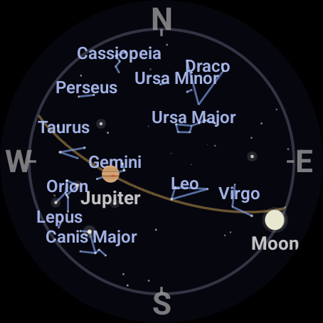
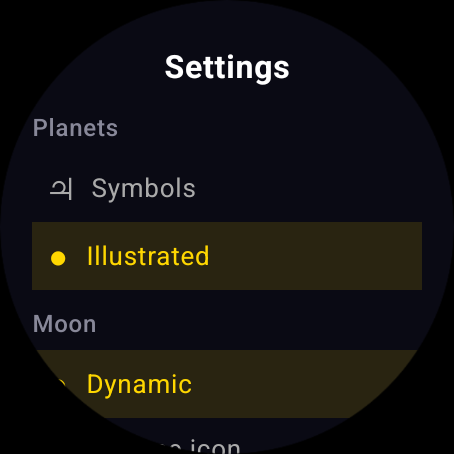

# Orrery

**A planetarium for your wrist.** Orrery is a Wear OS app that shows which planets,
stars, and constellations are overhead right now — computed entirely on your watch,
for wherever you're standing.

  
  &nbsp;&nbsp;
  
  &nbsp;&nbsp;
  

## What it does

- **Live sky map** — the whole visible sky on one circular dial: horizon at the edge,
  zenith in the center, every planet exactly where it is for your location
- **Sun, Moon & planets** — with the Moon's real current phase (hemisphere-correct),
  and your choice of all planets or naked-eye only
- **Stars & constellations** — the ~170 brightest stars sized by magnitude, with
  25 constellation stick figures and labels
- **The ecliptic** — the golden road the planets travel across the sky
- **Time scrubbing** — turn the crown to roll the sky forward or back an hour per
  click; see where Jupiter will be at midnight, tap to snap back to now
- **Living sky background** — the map shifts through sunrise, daylight, twilight,
  and night to match the actual sky above you
- **Watch face complications** — "Planets overhead" count, and the Moon's
  current illumination percentage, each tappable to open the app
- **Private by design** — fully offline, approximate location only, nothing ever
  leaves the watch; no ads, no analytics, no accounts

## Get it (free beta)

Orrery is free and currently in closed testing on Google Play:

1. Email **josh@joshmiller.ai** (or ping me if you know me) so I can add you to the
   tester list — Play requires it before the link works
2. Opt in at **https://play.google.com/apps/testing/ai.joshmiller.orrery**
3. Install from the Play Store on your Wear OS watch (Pixel Watch, Galaxy Watch 4+,
   and friends — Wear OS 3 / API 30 or newer)

Opting in also counts toward the tester quota Google requires before the app can go
fully public, so even joining without a watch helps.

## Tech

Kotlin + Jetpack Compose for Wear OS, all rendering hand-drawn on Canvas.
Planetary positions come from the excellent
[Astronomy Engine](https://github.com/cosinekitty/astronomy); stars are a
hand-curated bright-star catalog with J2000 coordinates. No servers, no network
calls — the whole sky fits in a 3.5 MB bundle.

[Privacy policy](https://joshmiller.ai/privacy/orrery.html)

---

*Made by one person who wanted to know what that bright dot above the sunset was.
(It was Venus.)*
